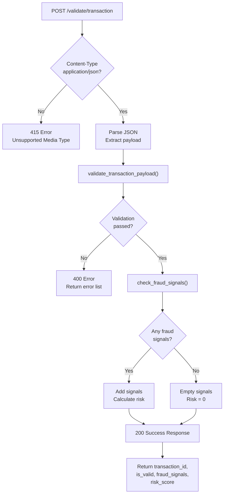

# Transaction Validator API - Architecture

## Overview

The Transaction Validator API is a lightweight, stateless Flask service that validates financial transaction data and detects potential fraud signals in real-time. The design prioritizes speed (<10ms per request) and clarity over complexity.

**Core Philosophy**: This is a heuristic-based fraud detection system, not a blocker. The API returns signals and risk scores for downstream systems to review—it never rejects transactions outright.

---

## Request Processing Flow

### ASCII Diagram

```
┌─────────────────────────────────────────────────────────────┐
│  Client sends POST /validate/transaction with JSON payload  │
└────────────────────┬────────────────────────────────────────┘
                     │
                     ▼
          ┌──────────────────────┐
          │ Check Content-Type   │
          │ = application/json?  │
          └──────┬───────────┬───┘
                 │ No        │ Yes
                 ▼           ▼
           415 Error    ┌──────────────────────┐
                        │ Parse JSON Payload   │
                        └──────┬───────────────┘
                               │
                               ▼
                    ┌──────────────────────────────┐
                    │ validate_transaction_payload │
                    │                              │
                    │ • Required fields present?   │
                    │ • Amount in valid range?     │
                    │ • Transaction type valid?    │
                    │ • Account ID valid?          │
                    │ • Timestamp valid + fresh?   │
                    └──────┬─────────────────┬─────┘
                           │ Errors          │ Valid
                           ▼                 ▼
                    ┌─────────────────┐  ┌──────────────────────┐
                    │ Return 400      │  │ check_fraud_signals  │
                    │ with error list │  │                      │
                    │                 │  │ • HIGH_VALUE?        │
                    │                 │  │ • EXCESSIVE_WITHDRAW?│
                    │                 │  │ • ROUND_AMOUNT?      │
                    │                 │  └──────┬───────────────┘
                    │                 │         │
                    │                 │         ▼
                    │                 │  ┌──────────────────────┐
                    │                 │  │ Calculate Risk Score │
                    │                 │  │ score = signals * 25 │
                    │                 │  └──────┬───────────────┘
                    │                 │         │
                    └─────────┬───────┴─────────┘
                              │
                              ▼
                    ┌──────────────────────┐
                    │ Return 200 with:     │
                    │ • transaction_id     │
                    │ • is_valid: true     │
                    │ • fraud_signals[]    │
                    │ • risk_score         │
                    └──────────────────────┘
```

### Mermaid Diagram



---

## Code Architecture

### Single-File Design

All business logic lives in `app.py` for simplicity. Structure from top to bottom:

#### 1. Constants (Lines 20-30)
Validation rules and thresholds that can be tuned:
- `TRANSACTION_TYPES`: Allowed transaction type values
- `MIN_AMOUNT`, `MAX_AMOUNT`: Numeric bounds
- `MIN_ACCOUNT_ID`, `MAX_ACCOUNT_ID`: Account ID range
- `DAILY_LIMIT`: Maximum withdrawal per day ($100,000)
- `SINGLE_TXN_HIGH_RISK`: Amount threshold for HIGH_VALUE signal ($50,000)
- `SUSPICIOUS_HOUR_THRESHOLD`: For future use (threshold for txns per hour)

#### 2. Response Helpers (Lines 37-71)
Utility functions for consistent response formatting:
- `success_response(data, status_code)`: Wraps successful responses with metadata
- `error_response(message, errors, status_code)`: Wraps error responses
- `log_request(f)`: Decorator that logs all incoming requests to stdout

#### 3. Validation (Lines 78-145)
`validate_transaction_payload(payload)` function:
- Checks that all required fields are present: `amount`, `transaction_type`, `account_id`, `timestamp`
- Validates amount is numeric and within range
- Validates transaction type is one of the allowed types (case-insensitive)
- Validates account ID is numeric and within valid range
- Validates timestamp is ISO 8601 format and not older than 90 days or in the future
- Returns tuple: `(is_valid: bool, errors: list)`

#### 4. Fraud Detection (Lines 148-186)
`check_fraud_signals(payload)` function:
- Analyzes transaction for heuristic patterns (not ML-based)
- Detects three signal types:
  - `HIGH_VALUE`: Amount >= $50,000 (MEDIUM severity)
  - `EXCESSIVE_WITHDRAWAL`: Withdrawal > $100,000 (HIGH severity)
  - `ROUND_AMOUNT`: Amount is multiple of $100 and >= $1,000 (LOW severity)
- Risk score is calculated as: `len(signals) * 25`
- Returns dict with `fraud_signals` array and `risk_score`

#### 5. Routes (Lines 193-522)

**GET /health**
- Simple liveness probe for load balancers
- Returns: `{"status": "success", "data": {"status": "healthy", "service": "transaction-validator"}}`

**POST /validate/transaction**
- Main endpoint for transaction validation
- Expects JSON with: `amount`, `transaction_type`, `account_id`, `timestamp`, optional `description`
- Returns 200 with fraud signals and risk score (even for valid transactions)
- Returns 400 if validation fails with error details
- Returns 415 if Content-Type is not application/json

**GET /docs**
- Serves HTML documentation page
- Explains fraud signals, provides curl examples
- No external dependencies (HTML embedded)

#### 6. Error Handlers (Lines 581-603)
Global error handlers for:
- 400: Bad requests (malformed JSON)
- 404: Not found
- 500: Internal server errors

#### 7. Entry Point (Lines 610-618)
- Configures logging
- Reads PORT environment variable (default: 5000)
- Starts Flask app on 0.0.0.0:PORT

---

## Data Structures

### Request Payload
```json
{
  "amount": 1234.56,
  "transaction_type": "TRANSFER",
  "account_id": 12345,
  "timestamp": "2024-05-18T14:30:00Z",
  "description": "Optional payment memo"
}
```

### Success Response (200)
```json
{
  "status": "success",
  "data": {
    "transaction_id": "TXN-1234567890",
    "is_valid": true,
    "amount": 1234.56,
    "transaction_type": "TRANSFER",
    "account_id": 12345,
    "fraud_signals": [
      {
        "type": "HIGH_VALUE",
        "severity": "MEDIUM",
        "message": "Transaction amount $1,234.56 exceeds $50,000 threshold"
      }
    ],
    "risk_score": 25
  },
  "timestamp": "2024-05-18T14:30:00.123456"
}
```

### Error Response (400/415)
```json
{
  "status": "error",
  "message": "Transaction validation failed",
  "errors": [
    "Amount must be >= $0.01",
    "Transaction type must be one of: TRANSFER, PAYMENT, DEPOSIT, WITHDRAWAL"
  ],
  "timestamp": "2024-05-18T14:30:00.123456"
}
```

---

## Deployment Architecture

### Render
- Detects Python environment via `requirements.txt`
- Auto-executes buildCommand: `pip install -r requirements.txt`
- Auto-executes startCommand from `render.yaml`: `gunicorn --workers 2 --worker-class sync --timeout 30 --bind 0.0.0.0:$PORT app:app`
- Health check: GET /health every 30 seconds
- Free tier: Single dyno, ~50MB memory

### Docker
- Multi-stage build (builder → final)
- Base image: `python:3.11-slim` (185MB, includes security patches)
- Runs as non-root user `appuser` (UID 1000) for security
- Health check via urllib (validates endpoint responds)
- Ports exposed on 5000

---

## Design Decisions

### Why Single File?
At the current scale (3 endpoints, 500 LOC), a single file is sufficient and easier to understand. Splitting into modules would introduce unnecessary indirection.

### Why No Database?
The design is intentionally stateless. Transactions are validated and returned immediately without persistence. If historical records are needed, a separate audit system should consume the API output.

### Why Heuristics, Not ML?
Heuristics are:
- Interpretable: Easy to explain why a transaction was flagged
- Performant: No model loading, inference overhead
- Auditable: Clear business rules for compliance

For production systems, integrate with specialized services (Stripe Radar, AWS Fraud Detector) for ML-based detection.

### Why Flask?
- Lightweight: No heavy frameworks
- Familiar: Industry standard for APIs
- Flexible: Easily add persistence/auth later

---

## Testing

### Manual Testing
Run `bash test_api.sh` to execute 10 smoke tests:
1. Health check
2. Valid transaction
3. Missing required field
4. Negative amount
5. Invalid transaction type
6. High-value transaction (with fraud signals)
7. Invalid timestamp format
8. API docs endpoint
9. 404 handling
10. Missing Content-Type header

### Future: Unit Tests
If adding pytest, follow this pattern:
```python
def test_valid_transaction():
    response = client.post('/validate/transaction', json={
        "amount": 100.00,
        "transaction_type": "TRANSFER",
        "account_id": 123,
        "timestamp": "2024-05-18T14:30:00Z"
    })
    assert response.status_code == 200
    assert response.json["data"]["is_valid"] == True
```

---

## Common Modifications

### Change a Fraud Detection Threshold
Edit the constants at the top of `app.py`:
```python
SINGLE_TXN_HIGH_RISK = 75_000  # Changed from 50_000
DAILY_LIMIT = 150_000          # Changed from 100_000
```

### Add a New Fraud Signal
1. Add logic in `check_fraud_signals()`:
```python
if some_condition:
    signals.append({
        "type": "NEW_SIGNAL_TYPE",
        "severity": "LOW|MEDIUM|HIGH",
        "message": "Descriptive message"
    })
```
2. Update `/docs` HTML endpoint to document the new signal
3. Test with `bash test_api.sh`

### Add a New Endpoint
Add a route in the "Routes" section:
```python
@app.route("/api/merchant/<int:merchant_id>", methods=["GET"])
def get_merchant_risk(merchant_id):
    return success_response({"merchant_id": merchant_id, "risk_level": "LOW"})
```

---

## Known Limitations

- **No persistence**: Transactions are not stored
- **Single instance**: No load balancing (upgrade Render plan for HA)
- **Simple heuristics**: Not suitable for sophisticated fraud schemes
- **No rate limiting**: Add with `flask-limiter` if needed
- **No authentication**: All endpoints are public (add API keys if needed)
- **SUSPICIOUS_HOUR_THRESHOLD**: Defined but not implemented yet

---

## Future Improvements

- Batch validation endpoint (`POST /validate/batch`)
- Rate limiting per account
- Request signing (HMAC) for webhook security
- Integration with external fraud services (Stripe Radar, AWS Fraud Detector)
- PostgreSQL for transaction history
- Webhook support for fraud alerts
- OpenAPI/Swagger integration
